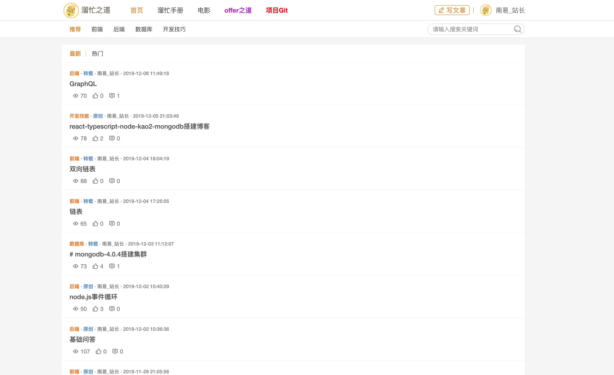
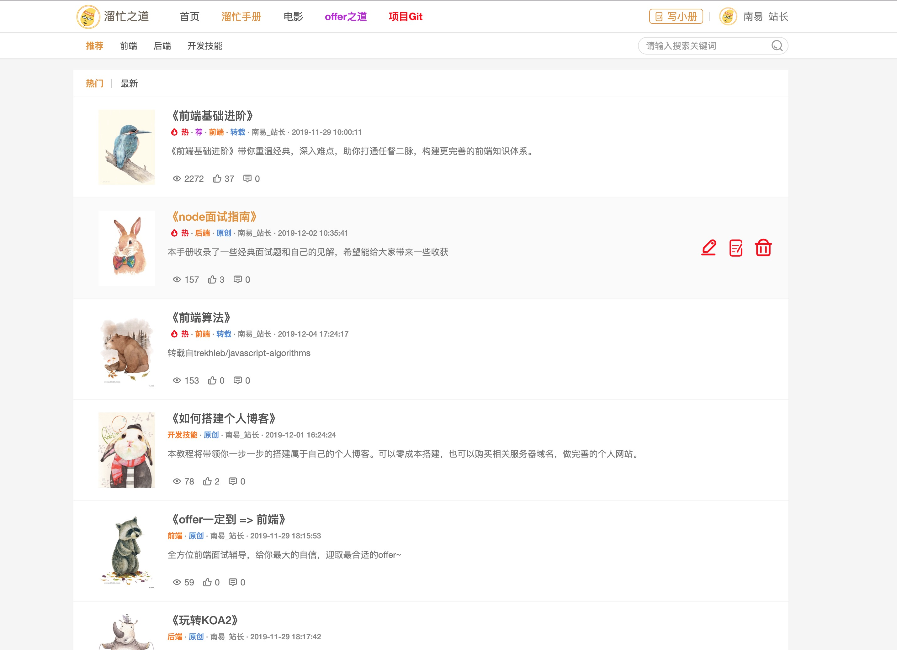
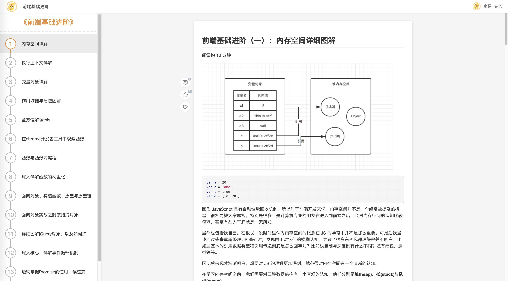
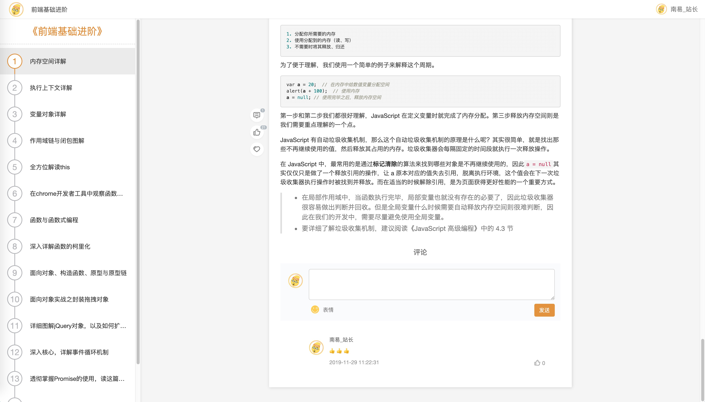
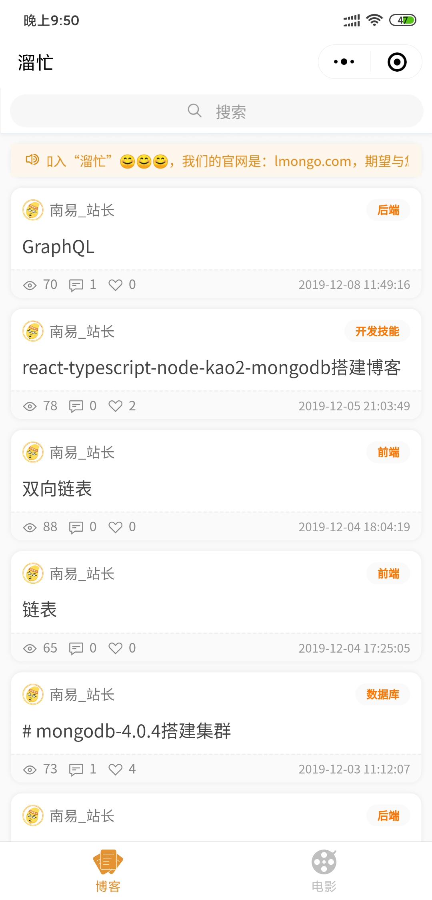
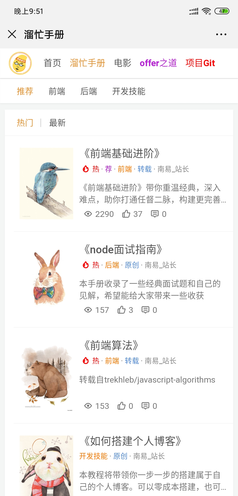

# <a href="https://fengzq.cn"> 🔥 溜忙之道<a/>

基于 Node.js express 实战开发的一套完整的博客项目网站，使用 express 二次开发一套适合多端的 RESTful API，前端展示既有基于 ejs 服务端渲染，也有基于 Taro 开发的前后端分离的小程序。

#### 主要功能模块

- 博客
- 教程手册（仿掘金小册）
- 电影（爬虫，抓取电影天堂）。

#### 访问域名

- https://fengzq.cn

## 服务端

#### 软件要求

- node >= 10
- npm >= 6
- mongodb >= 3.0
- typescript >= 3.0

#### 启动项目

##### 测试环境

- 安装相关包

```bash
npm install -g nodemon
npm install -g ts-node
npm install -g typescript
npm install
```

- 启动本地测试

```
nodemon
```

##### 正式环境

- 安装`pm2`、 `typescript`

```
npm install -g pm2
pm2 install typescript
```

- 运行

```
## 运行打包后的
pm2 start ./build/config/server/index.js

pm2 start ./src/config/server/index.ts --watch     当文件变化时自动重启应用

$ pm2 delete all               关闭并删除所有应用
```

#### 测试

```bash
npm test

```

#### 设置开发环境

在根文件夹中可以找到“.env”。您可以使用此配置，或根据自己的需求进行修改
如果要添加一些新变量，还需要将它们添加到 interface 和 config 对象中 (查看 `src/config/index.ts`)

#### Swagger

```bash
npm install -g swagger-jsdoc
swagger-jsdoc -d swaggerDef.js -o swagger.json
```

Swagger 查看地址

```bash
http://localhost:3000/docs
```

#### 启动爬虫 接口

- 爬取列表 /reptile/movieRt
- 爬取详情 /reptile/getMvDetail

## 小程序

#### 小程序二维码


#### 框架官网

https://nervjs.github.io/taro/docs/GETTING-STARTED.html

#### UI 框架

https://taro-ui.aotu.io/#/docs/fab
https://github.com/NervJS/taro-ui-demo

#### 使用 npm 安装 CLI

\$ npm install -g @tarojs/cli

#### OR 使用 yarn 安装 CLI

\$ yarn global add @tarojs/cli

#### OR 安装了 cnpm，使用 cnpm 安装 CLI

\$ cnpm install -g @tarojs/cli ##启动微信小程序

```
# yarn
$ yarn dev:weapp
$ yarn build:weapp
# npm script
$ npm run dev:weapp
$ npm run build:weapp
# 仅限全局安装
$ taro build --type weapp --watch
$ taro build --type weapp
# npx 用户也可以使用
$ npx taro build --type weapp --watch
$ npx taro build --type weapp

```

#### pc 网站截图

#### 首页



#### 电影板块


#### 手册模块



#### 手册内容



#### 内容评论 电影，博客，手册前后台都同一采用评论模块



#### 电影详情


#### 电影评论


## 小程序截图




## 移动 web



